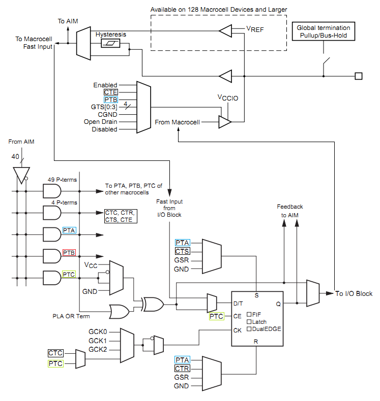
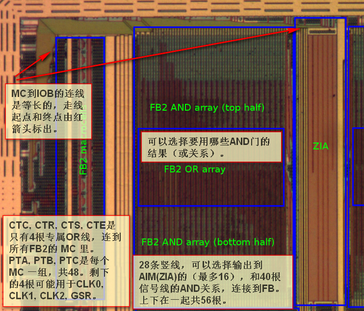
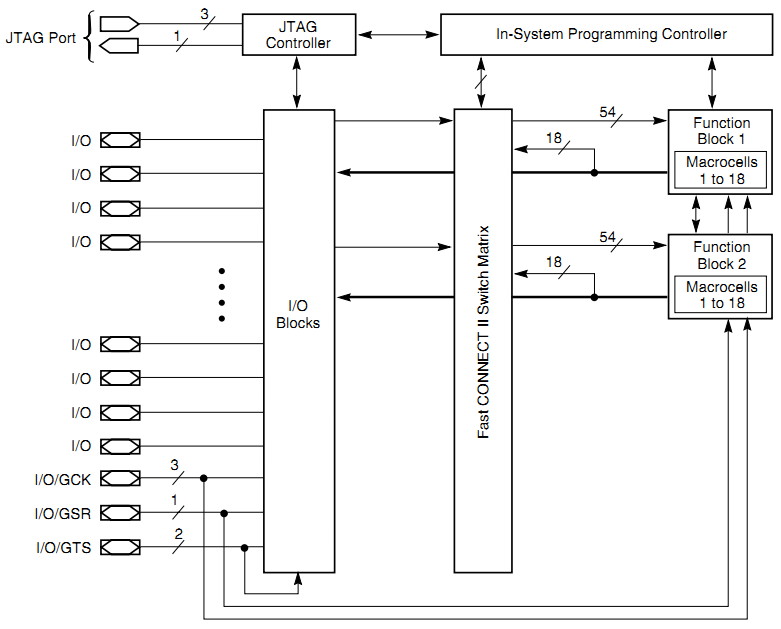

< 
:doc:`主页<index>` /
:doc:`目录<index_chs>` /
>

CPLD & Jtag
===============

CoolRunner-II
-------------------
以下会基于Xilinx公开的文档对CoolRunner-II的内部实现机制做一些猜测。
因为Xilinx并没有完全公开内部的实现，所以不一定是正确的。

这个是整体的系统结构图 [#architecture]_ :

.. image:: images/coolrunner_II_architecture.png

可以看到有这么几大块：

* BSC and ISP ——调试和在线配置模块
* I/O Blocks ——IO模块
* FBs ——Function Blocks（功能模块），其中包含两个子模块：

  * MC1到MC16 是16个Macrocell（宏单元），包含触发器和一些选通逻辑、组合逻辑。
  * PLA 是Programable Logic Array（就是以前常说的乘积项阵列），
    和最早出现的同名的“PLA”器件的实现几乎一样。提供AND逻辑阵列，和OR逻辑阵列。

* AIM 全称Advanced Interconnect Matrix（高级互联矩阵），用于FBs的互联，
  从网上公开的资料来看，不是100%互联的开关矩阵，而是40-6的阵列
  （可以确定的是XC9500XL系列的FastConnect是开关矩阵）。

PLA不同于PAL，这里附上可编程器件PAL的细节 [#pal]_ ：

.. image:: images/PAL.png

再看看Lattice的GAL16V8细节：

.. image:: images/GAL16V8.png

PAL的或逻辑是固定输入的！

这个是从xilinx的2个文档里弄的截图，自己做了一些连线和线框标注，
可以说明PLA和MC的一些细节：

FBs
###

.. image:: images/coolrunner_II_FBs.png

Function Block是CPLD可编程的基础，不同容量的CPLD本质上只是FB的个数不同。

PLA
###

.. image:: images/coolrunner_II_PLA_and_or_logic.png

图上的PT1到PT56是真的有56路，而MC1到MC56只是举例，实际只有16个！

从AIM给到Function Block的信号有40路，每一路信号在内部使用的时候做了预处理，
分成原始信号和反向信号，这样就不用Macrocell来做反向逻辑了。

.. image:: images/coolrunner_II_PLA.png

上图红框圈出的是PLA（为了不引起歧义，
只保留“线与”，“线或”擦除了），其它部分是Macrocell。
PLA通过“线与”阵列生成的乘积项有部分是固定连线（不一定要做原始的用途）。
并且所有的“线与”信号会给到“线或”阵列，Macrocell可以选择使用哪些信号。

每个FB的PLA可以给出的“线与”信号共有56路：

* 4路：CTC（Clock）、CTR（Reset）、CTS（Set）、CTE（IO Enable）是一个FB里Macrocell公用的。
* 3*16路：每个MC都有3根固定的连线PTA（Set/Reset）、PTB（IO Enable）、PTC（Clock）。
* 4路：未知，因为给到Function Block的还有一根全局置位复位、3根全局时钟，
  所以猜测这4路是这四根线。

需要说明的是每个MC还有一个“线或”输入，和上述的56路信号没有固定关系。
每个MC都可以使用56路的任何组合！
这么设计的好处是资源可以复用，坏处就是某些情况下资源利用率会降低：
如果“线或”逻辑太复杂，可能PTA、PTB、PTC就不够用了。

Xilinx给出PLA的例子，乘积项复用情况的：

.. image:: images/coolrunner_II_PLA_example.png

CTC、CTS被使用了，所以那4路信号就只是2路可用，
不过如果其它的Macrocell需要使用的CTC、CTS逻辑一样，
可以直接使用这两路CTC、CTS信号。

Die
####################
这个是XC2C32A的Die [#xc2c32a_die]_ :

.. image:: images/xc2c32a_die.jpg

对比官方的手册 [#f1]_ [#f2]_ 简单分析一下Die :

CoolRunner-II内部的可编程节点是很多1bit的SRAM，
Flash作为一大块整列放置，在配置的时候加载到可编程节点的SRAM里。

而XC9500XL是直接在每个可编程节点上实现了Flash。

XC9500XL
--------------
XC9500XL属于xilinx上一代的CPLD，在新的设计中基本不会再用，
但是提供的资料比较多，而且涉及到内部的实现，所以让我们看看Xilinx的XC9500XL。

.. image:: images/xc9500xl_architecture.png

FastConnect
###########
从这个图来理解：

.. image:: images/xc9500xl_connect.png

请注意这可是完整的开关矩阵，能100%布线通过，非常占用资源的！
所以在CoolRunner-II里改成了部分开关矩阵，不能100%布通的。

这个是芯片的Die [#xc9536xl_die]_ :

.. image:: images/xc9536xl_die.jpg

在来看看文档上是怎么样的 [#xc9536xl_architecture]_ :

可以看到FastConnect将所有从IO得到信号和两个Function Block的输出都收集起来，
然后给两个Function Block！XC9536XL有最多36个可用的IO，那么FastConnect就有
36+18+18=72路输入信号。而每个Function Block有54路输入，
可以从这72路信号里任意选择54路。

这54路信号经内部反向得到108路组成108-90的“线与”阵列，
其中每个Macrocell分配5个输出，每个Function Block包含18个宏单元。

FBs
###

.. image:: images/xc9500xl_FBs.png

看看细节，最左边是AND阵列（乘积项），“Product Term Allocator”可以自由的选择使用乘积项结果。

.. image:: images/xc9500xl_FBs_detail.png

PTA
###
给出PTA的细节：

.. image:: images/xc9500xl_pta.png

图上的标注是我自己弄的，5路输入都可以直接选择给到OR4，
作为“线或”逻辑，或者用做独立的功能。
而XOR可以选择直接用PTA作为D触发器的输入，或者1，或者0，或者“线或”结果。

OR1、OR2、OR3可以让临近（上下）的Macrocell共享逻辑资源。
这种设计相对于CoolRunner-II的“线或”阵列设计，乘积项的复用率较低。

IOs
###
JTAG接口包含TAP状态机和ISP在线编程模块。
TAP包含3个主要的寄存器：

* IR（Instruction Register）
* DR（Data Register）
* BSC（Boundary Scan Chain）

我们再看看JTAG的设计：

.. image:: images/xc9500xl_jtag_internal.png

从图中看到TCK和TMS是给到TAP状态机的，IR和DR是寄存器，BSC是连接到边界IO的寄存器。

IO扫描实现是这样的：

.. image:: images/xc9500xl_bsc.png

我们先分析IO输入信号。IOB.I是从IO给到内部逻辑的，当INTEST有效的时候，
最右边的多路选择器会使用内部的锁存器，而不是真实的外部信号。

当SHIFT/CAPTURE有效的时候，左边的三个3-1多路选通器会选中1x端，
这样D触发器就级联成多位锁存器，当TCK给个上升沿的时候，
TDI会从最上端给进来，数据移动一位，延迟一段很短的时间后TDO会被更新。

当使用EXTEST就是外部测试的时候，IOB.O会替换“输出D触发器”的值。
而且当IOB.T有效的时候，测试信号IOB.O会真正的给到PAD。
只有当UPDATE信号有效的时候，TCK上升沿会将触发器的数据更新到右侧。

JTAG 4-wires
------------

JTAG的四线：

.. image:: images/jtag_hardware_look.jpg

* TCK（Test Clock）由调试器给到设备的测试时钟
* TMS（Test Mode State）由调试器给到设备的信号，用于切换TAP的状态
* TDI（Test Data Input）对于被测设备是数据输入，对于调试器是数据输出
* TDO（Test Data Output）对于被测设备是数据输出，对于调试器是数据输出

不同厂家的线序一般是不一样的，而且TAP状态机的寄存器位数也不一样，
这直接导致各个下载线不兼容，如果开发板上有ARM、FPGA、DSP，
那么就不可避免的用到3条下载线了……

这个是ulink的各种常见的接口定义

.. image:: images/ulink2_connector_20_16_14_10pin.png

这个是xilinx的接口定义

.. image:: images/xilinx_connector_14_10pin.png

JTAG Timing
------------
XC9500XL文档里规定的JTAG时序是这样的

.. image:: images/xc9500xl_JTAG_TIMING.png

从XC9500XL的时序可以看到时钟最高为10Mhz，TMS的建立时间“TMSS”为10ns。
TMS的保持时间“TMSH”为10ns。TDI的建立和保持时间分别是15ns和25ns。
TDO的延迟为35ns。

JTAG TAP
---------
TAP状态机只和TCK、TMS有关。一般在TCK的下降沿更新TMS、TDI的电平，在TCK的上升沿采样TDO的电平，这样保证建立保持时间是符合要求的，数据是稳定的。

TAP状态切换图

.. image:: images/jtagFSM.png

可以看到一般情况下TMS为高的时候会切换状态，TMS为低的时候是保持，而Test-Logic-Reset是在TMS为高的时候保持。这么设计的目的是，如果不知道当前的状态，那么拉高TMS，持续5个TCK时钟就一定可以跳转到Test-Logic-Reset状态（仔细看看状态跳转图）。
以下只是为了说明在各个状态下，DR收到TCK后的行为，并不是实际的代码。
IR的实现是类似的。

Select-DR-Scan
##############

.. code-block:: verilog

    //verilog
    always@(posedge TCK)
    begin
        if ((tap == SELECT_DR_SCAN) && !TMS)
            addr_reg <= ADDR_DR;
        else
            addr_reg <= addr_reg;
    end

Capture-DR
##########

.. code-block:: verilog

    //verilog
    always@(posedge TCK)
    begin
        if (tap == CAPTURE_DR)
            r_dr <= odata_dr;
        else
            r_dr <= r_dr;
    end

可以看到当从Capture-DR跳转到Shift-DR后，TDO已经是有效的了，但是TDI并没有移入。
只有在Shift-DR的状态给出TCK上升沿才能移入TDI数据。

Shift-DR
########

.. code-block:: verilog

    //verilog
    always@(posedge TCK)
    begin
        if (tap == SHIFT_DR)
            r_dr <= {r_dr, TDI};
        else
            r_dr <= r_dr;
    end

需要注意的是最后从Shift-DR跳转到Exit1-DR的时候DR寄存器还是会移入一位TDI，
所以在处理的时候需要特别的注意。一般如果DR有N位，那么前N-1位保持TMS为0，
在最后一次需要把TMS置1。我最开始的时候就是没有注意这部分，导致移位总错。

Pause-DR
########

这个用途看起来没有用，其实还是可以好好用的，比如用SPI实现JTAG的时序，
如果那个SPI只能配置成8或16位，那么移位数据的时候一定是8的倍数的TCK上升沿，
在Pause-DR状态停留几次就可以保证不会有错误的状态跳转了。

Update-DR
#########

.. code-block:: verilog

    //verilog
    always@(posedge TCK)
    begin
        if ((tap == UPDATE_DR)
            io <= dr;
        else
            io <= io;
    end

.. rubric:: Footnotes

.. [#architecture] ds090: CoolRunner-II CPLD Family, page 4
.. [#pal] Architecture of FPGAs and CPLDs: A Tutorial, page 5
.. [#xc9536xl_architecture] ds058: XC9536XL High Performance CPLD, page 2
.. [#f1] xapp376 Understanding the CoolRunner-II Logic Engine
.. [#f2] xapp444 CPLD Fitting, Tips and Tricks
.. [#xc2c32a_die] http://siliconpr0n.org/archive/doku.php?id=azonenberg:xilinx:xc2c32a
.. [#xc9536xl_die] http://siliconpr0n.org/archive/doku.php?id=mcmaster:xilinx:xc9536xl

