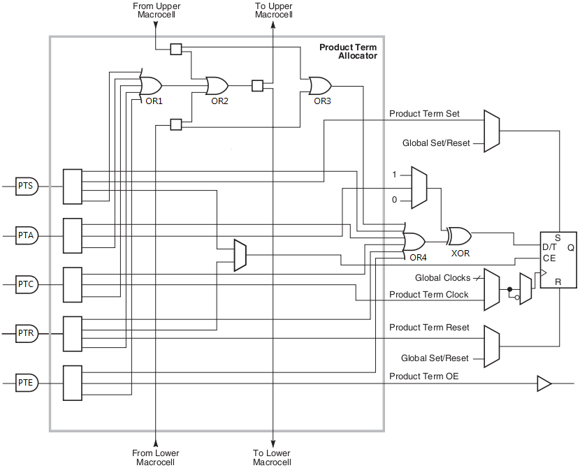

< 
:doc:`主页<index>` /
:doc:`目录<index_chs>` /
>

CPLD内部结构
===============

XC9500XL
--------------
XC9500XL属于xilinx上一代的CPLD，在新的设计中基本不会再用，
但是提供的资料比较多，而且涉及到内部的实现，所以让我们先看看Xilinx的XC9500XL。

.. image:: images/xc9500xl_architecture.png

这块CPLD的Jtag在核心的功能模块、快速连接矩阵、IO外还实现了一个Jtag接口，包含TAP状态机和ISP在线编程模块。

TAP包含3个主要的寄存器：

* IR（Instruction Register）
* DR（Data Register）
* BSC（Boundary Scan Chain）

我们再看看Jtag的设计：

.. image:: images/xc9500xl_jtag_internal.png

从图中看到TCK和TMS是给到TAP状态机的，IR和DR是寄存器，BSC是连接到边界IO的寄存器。

FBs
###
每个Function Block包含18个宏单元。每个宏单元用18根线连到FastCONNECT矩阵，
矩阵提供54根信号线给功能模块。还有些线是ISP编程线、全局时钟线。

看看细节，最左边是AND阵列（乘积项），“Product Term Allocator”可以自由的选择使用乘积项结果。

.. image:: images/xc9500xl_FBs_detail.png

PTA
###
给出PTA的细节：

FastConnect
###########
这样连线就好理解了：

IOs
###
IO扫描实现是这样的：

.. image:: images/xc9500xl_bsc.png

我们先分析IO输入信号。IOB.I是从IO给到内部逻辑的，当INTEST有效的时候，
最右边的多路选择器会使用内部的锁存器，而不是真实的外部信号。

当SHIFT/CAPTURE有效的时候，左边的三个3-1多路选通器会选中1x端，
这样D触发器就级联成多位锁存器，当TCK给个上升沿的时候，
TDI会从最上端给进来，数据移动一位，延迟一段很短的时间后TDO会被更新。

当使用EXTEST就是外部测试的时候，IOB.O会替换“输出D触发器”的值。
而且当IOB.T有效的时候，测试信号IOB.O会真正的给到PAD。
只有当UPDATE信号有效的时候，TCK上升沿会将触发器的数据更新到右侧。

这个是芯片的Die [#xc9536xl_die]_ :

CoolRunner-II
-------------------
前面简单介绍了一下XC9500XL的Jtag结构，鉴于XC9500XL系列属于淘汰的型号，
并且手头只有CoolRunner-II的板子，为了方便后续的测试，
有必要了解CoolRunner-II的内部实现机制。因为Xilinx并没有完全公开内部的实现，
所以以下的结构有部分是猜测的。

我们来看看最新的CoolRunner-II系列。

这个是整体的系统结构图 [#f1]_ :

.. image:: images/coolrunner_II_architecture.png

可以看到有这么几大块：

* BSC and ISP 是调试和在线配置模块
* I/O Blocks 是IO模块
* FBs 是Function Blocks（功能模块），其中包含两个子模块：

  * MC1到MC16 是16个Macrocell（宏单元），包含触发器和一些基本的门
  * PLA 是Programable Logic Array（就是以前常说的乘积项阵列），用于实现AND逻辑，并给出可组合的OR逻辑阵列

* AIM 全称Advanced Interconnect Matrix（高级互联矩阵），用于FBs的互联

FBs
###
FB是CPLD可编程的基础，从AIM给到PLA的信号有40路，每一路信号在内部使用的时候做了预处理，
包含原始信号和反向信号，这样可以很方便的使用信号。
虽然这种设计看似多了很多反相器，比较浪费，但这么一来就没必要用单独的Macrocell来做反向了。
其实资源利用率还是很高的。

.. image:: images/coolrunner_II_FBs.png

PLA
###
PLA生成的乘积项会通过“线或”阵列给到Macrocell。
看看PLA和一个宏单元的内部，红框是PLA，其它部分是Macrocell。
每个FB的PLA可以给出的信号共有56路（可以用作PTA、PTB、PTC或CTC、CTR、CTS、CTE）。

.. image:: images/coolrunner_II_PLA.png

Xilinx给出的使用例子，乘积项是可以复用的：

.. image:: images/coolrunner_II_PLA_example.png

所以可以猜测macrocell有52根乘积项可以用作PTA、PTB、PTC，
4根乘积项可以用做CTC、CTR、CTS、CTE控制线。

从Xilinx的技术介绍里可以找到这幅图 [#f2]_ 和 [#f3]_

.. image:: images/coolrunner_II_PLA_and_or_logic.png

.. image:: images/coolrunner_II_PLA_detail.png

从AIM给的信号有A、B、C，红点是配置成短路，X是断路。
这幅图为了便于说明可编程节点的功能，省掉了一些细节。
表达式 Y = A&B|C，X = A&B|!C，这里的X、Y可以是给到Macrocell的信号。
由于这里可以复用A&B的结果，所以节约了资源。

关于“可编程节点”的实现可以看看GAL、PAL的实现

这里附上可编程器件PAL的细节 [#f4]_ ：

.. image:: images/PAL.png

再看看Lattice的GAL16V8细节：

.. image:: images/GAL16V8.png

只要接触过三极管的集电极开路（OC）、场效应管漏极开路（OD）实现的线与、线或逻辑
就容易理解上面这些“可编程节点”。
两个OC门并联、并添加上拉电阻就可以实现“线与”的功能，
“线或”可以在“线与”的基础上添加反相器得到。

Timing
------
XC9500XL文档里规定的Jtag时序是这样的

.. image:: images/xc9500xl_JTAG_TIMING.png

从XC9500XL的时序可以看到时钟最高为10Mhz，TMS的建立时间“TMSS”为10ns。
TMS的保持时间“TMSH”为10ns。TDI的建立和保持时间分别是15ns和25ns。
TDO的延迟为35ns。

TAP
---------
TAP状态机只和TCK、TMS有关。一般在TCK的下降沿更新TMS、TDI的电平，在TCK的上升沿采样TDO的电平，这样保证建立保持时间是符合要求的，数据是稳定的。

TAP状态切换图

.. image:: images/jtagFSM.png

可以看到一般情况下TMS为高的时候会切换状态，TMS为低的时候是保持，而Test-Logic-Reset是在TMS为高的时候保持。这么设计的目的是，如果不知道当前的状态，那么拉高TMS，持续5个TCK时钟就一定可以跳转到Test-Logic-Reset状态（仔细看看状态跳转图）。

以下只是为了说明在各个状态下，收到TCK后的行为，并不是实际的代码。

Select-DR-Scan
##############

.. code-block:: verilog

    //verilog
    always@(posedge TCK)
    begin
        if ((tap == SELECT_DR_SCAN) && !TMS)
            addr_reg <= ADDR_DR;
        else
            addr_reg <= addr_reg;
    end

Capture-DR
##########

.. code-block:: verilog

    //verilog
    always@(posedge TCK)
    begin
        if (tap == CAPTURE_DR)
            r_dr <= odata_dr;
        else
            r_dr <= r_dr;
    end

可以看到当从Capture-DR跳转到Shift-DR后，TDO已经是有效的了，但是TDI并没有移入。
只有在Shift-DR的状态给出TCK上升沿才能移入TDI数据。

Shift-DR
########

.. code-block:: verilog

    //verilog
    always@(posedge TCK)
    begin
        if (tap == SHIFT_DR)
            r_dr <= {r_dr, TDI};
        else
            r_dr <= r_dr;
    end

需要注意的是最后从Shift-DR跳转到Exit1-DR的时候DR寄存器还是会移入一位TDI，
所以在处理的时候需要特别的注意。一般如果DR有N位，那么前N-1位保持TMS为0，
在最后一次需要把TMS置1。我最开始的时候就是没有注意这部分，导致移位总错。

Pause-DR
########

这个用途看起来没有用，其实还是可以好好用的，比如用SPI实现Jtag的时序，
如果那个SPI只能配置成8或16位，那么移位数据的时候一定是8的倍数的TCK上升沿，
在Pause-DR状态停留几次就可以保证不会有错误的状态跳转了。

Update-DR
#########

.. code-block:: verilog

    //verilog
    always@(posedge TCK)
    begin
        if ((tap == UPDATE_DR)
            io <= dr;
        else
            io <= io;
    end

IR的实现是类似的。

这个是XC2C32A的Die [#xc2c32a_die]_ :

.. image:: images/xc2c32a_die.jpg

.. rubric:: Footnotes

.. [#f1] ds090 CoolRunner-II CPLD Family, page 4
.. [#f2] xapp376 Understanding the CoolRunner-II Logic Engine, page 4
.. [#f3] xapp444 CPLD Fitting, Tips and Tricks, page 2
.. [#f4] Architecture of FPGAs and CPLDs: A Tutorial, page 5
.. [#xc2c32a_die] http://siliconpr0n.org/archive/doku.php?id=azonenberg:xilinx:xc2c32a
.. [#xc9536xl_die] http://siliconpr0n.org/archive/doku.php?id=mcmaster:xilinx:xc9536xl

