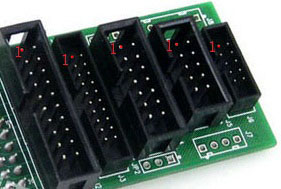
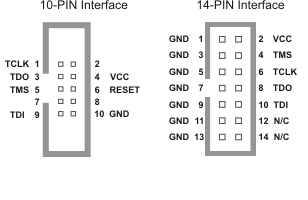

Jtag简介
========

Jtag是Joint Test Action Group的缩写，简单来说就是“在线测试和边界扫描”。常见的ARM、CPLD、FPGA都带有Jtag接口，可以用于更新固件，测试IC的IO功能。
  
Jtag接口
--------

Jtag一般包含4根线

* TCK（Test Clock）由调试器给到设备的测试时钟
* TMS（Test Mode State）由调试器给到设备的信号，用于切换TAP的状态
* TDI（Test Data Input）对于被测设备是数据输入，对于调试器是数据输出
* TDO（Test Data Output）对于被测设备是数据输出，对于调试器是数据输出

Jtag常见的用途是在线调试、固件下载。虽然标准中只规定了4线：TCK、TDI、TDO、TMS。

但是不同的厂家的接口线序不一样，而且TAP状态机的寄存器位数也不一样，
这直接导致各个下载线不兼容，每个开发板上ARM、FPGA的接口都不一样，而且每家的FPGA也不兼容。

这个是ulink的各种常见的接口定义

.. image:: images/ulink2_connector_20_16_14_10pin.png

这个是xilinx的接口定义

XC9500XL的实现
--------------

再看看Xilinx的xc9500xl（CPLD）里Jtag功能的实现，包含了一个TAP状态机、3个主要的寄存器：

* IR（Instruction Register）
* DR（Data Register）
* BSC（Boundary Scan Chain）

.. image:: images/xc9500xl_jtag_internal.png

可以从图中看到TCK和TMS是给到TAP状态机的，可以在TCK的上升沿根据不同的TMS电平切换状态。

具体到IO扫描的实现是这样的。

.. image:: images/xc9500xl_bsc.png

xc9500xl文档里规定的Jtag时序是这样的

.. image:: images/xc9500xl_JTAG_TIMING.png

