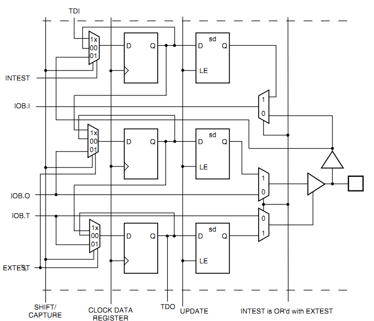
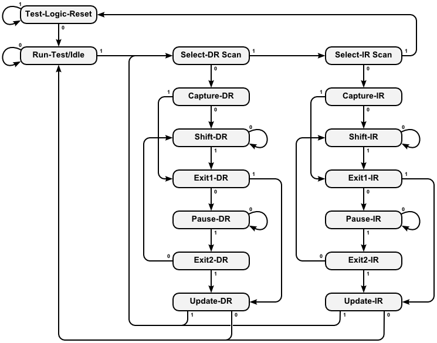

< 
:doc:`主页<index>` /
:doc:`目录<index_chs>` /
>

简介
========

Jtag是Joint Test Action Group的缩写，简单来说就是“在线测试和边界扫描”。常见的ARM、CPLD、FPGA都带有Jtag接口，可以用于更新固件，测试IC的IO功能。
  
Jtag接口
--------

Jtag一般包含4根线

* TCK（Test Clock）由调试器给到设备的测试时钟
* TMS（Test Mode State）由调试器给到设备的信号，用于切换TAP的状态
* TDI（Test Data Input）对于被测设备是数据输入，对于调试器是数据输出
* TDO（Test Data Output）对于被测设备是数据输出，对于调试器是数据输出

Jtag常见的用途是在线调试、固件下载。虽然标准中只规定了4线：TCK、TDI、TDO、TMS。

但是不同的厂家的接口线序不一样，而且TAP状态机的寄存器位数也不一样，
这直接导致各个下载线不兼容，每个开发板上ARM、FPGA的接口都不一样，而且每家的FPGA也不兼容。

这个是ulink的各种常见的接口定义

.. image:: images/ulink2_connector_20_16_14_10pin.png

这个是xilinx的接口定义

.. image:: images/xilinx_connector_14_10pin.png

本文档会优先完成CPLD的Jtag配置，然后再实现ARM的调试下载功能。

XC9500XL的实现
--------------
让我们来看看Xilinx的xc9500xl。
这块CPLD的Jtag实现了一个TAP状态机和3个主要的寄存器：

* IR（Instruction Register）
* DR（Data Register）
* BSC（Boundary Scan Chain）

.. image:: images/xc9500xl_jtag_internal.png

从图中看到TCK和TMS是给到TAP状态机的，可以在TCK的上升沿根据不同的TMS电平切换状态。

IR和DR是寄存器，BSC是连接到边界IO的。

具体到IO扫描的实现是这样的

先分析IO输入信号。IOB.I是从IO给到内部逻辑的，当INTEST有效的时候，
最右边的多路选择器会使用内部的锁存器，而不是真实的外部信号。

当SHIFT/CAPTURE有效的时候，左边的三个3-1多路选通器会选中1x端，
这样D触发器就级联成多位锁存器，当TCK给个上升沿的时候，
TDI会从最上端给进来，数据移动一位，延迟一段很短的时间后TDO会被更新。

当使用EXTEST就是外部测试的时候，IOB.O会替换“输出D触发器”的值。
而且当IOB.T有效的时候，测试信号IOB.O会真正的给到PAD。
只有当UPDATE信号有效的时候，TCK上升沿会将触发器的数据更新到右侧。

xc9500xl文档里规定的Jtag时序是这样的

.. image:: images/xc9500xl_JTAG_TIMING.png

从xc9500xl的时序可以看到时钟最高为10Mhz，TMS的建立时间“TMSS”为10ns。
TMS的保持时间“TMSH”为10ns。TDI的建立和保持时间分别是15ns和25ns。
TDO的延迟为35ns。

TAP状态机
---------
TAP状态机只和TCK、TMS有关。一般在TCK的下降沿更新TMS、TDI的电平，在TCK的上升沿采样TDO的电平，这样保证建立保持时间是符合要求的，数据是稳定的。

TAP状态切换图

可以看到一般情况下TMS为高的时候会切换状态，TMS为低的时候是保持，而Test-Logic-Reset是在TMS为高的时候保持。这么设计的目的是，如果不知道当前的状态，那么拉高TMS，持续5个TCK时钟就一定可以跳转到Test-Logic-Reset状态（仔细看看状态跳转图）。

以下只是为了说明在各个状态下，收到TCK后的行为，并不是实际的代码。

Select-DR-Scan
##############

.. code-block:: verilog

    //verilog
    always@(posedge TCK)
    begin
        if ((tap == SELECT_DR_SCAN) && !TMS)
            addr_reg <= ADDR_DR;
        else
            addr_reg <= addr_reg;
    end

Capture-DR
##########

.. code-block:: verilog

    //verilog
    always@(posedge TCK)
    begin
        if (tap == CAPTURE_DR)
            r_dr <= odata_dr;
        else
            r_dr <= r_dr;
    end

可以看到当从Capture-DR跳转到Shift-DR后，TDO已经是有效的了，但是TDI并没有移入。
只有在Shift-DR的状态给出TCK上升沿才能移入TDI数据。

Shift-DR
########

.. code-block:: verilog

    //verilog
    always@(posedge TCK)
    begin
        if (tap == SHIFT_DR)
            r_dr <= {r_dr, TDI};
        else
            r_dr <= r_dr;
    end

需要注意的是最后从Shift-DR跳转到Exit1-DR的时候DR寄存器还是会移入一位TDI，
所以在处理的时候需要特别的注意。一般如果DR有N位，那么前N-1位保持TMS为0，
在最后一次需要把TMS置1。我最开始的时候就是没有注意这部分，导致移位总错。

Pause-DR
########

这个用途看起来没有用，其实还是可以好好用的，比如用SPI实现Jtag的时序，
如果那个SPI只能配置成8或16位，那么移位数据的时候一定是8的倍数的TCK上升沿，
在Pause-DR状态停留几次就可以保证不会有错误的状态跳转了。

Update-DR
#########

.. code-block:: verilog

    //verilog
    always@(posedge TCK)
    begin
        if ((tap == UPDATE_DR)
            io <= dr;
        else
            io <= io;
    end

IR的实现是类似的。

