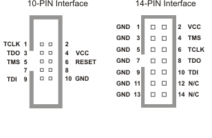

< 
:doc:`Home<index>` /
:doc:`Contents<index_enu>` /
>

Preface
========

Jtag is abbreviation of Joint Test Action Group. Most ICs have jtag interface, such like ARM, CPLD, FPGA. And we use Jtag to program new firmware or test IO.

This book aim at design and implement a Jtag adapter. I have done a Jtag adapter for special device. But It is waste of time build Jtag adapter for every hardware project. So I want to make it to be General Purpose:) As I know OpenOCD is best tool for this purpose, but It aim at use jtag, not build a jtag tool. The code is very large and difficute for hardware engineer, by the way, easier for software engineer.

If you want a Jtag adapter, it is not so difficute, but If you want newbee to known Jtag and modify a Jtag adapter for some special need, it is really hard. Because Jtag is mostly hardware tool. And I will introduct and explain some tech of Jtag and then we build a Jtag adapter. 

I thinking the better way is introduct CPLD, cause using CPLD and FPGA for a long time. The second reason is CPLD is easier than FPGA and ARM. An a project to config CPLD is completion work, and not so difficute. So I decided to do so.

And the reason I choose xilinx's cpld, is I have used xilinx device only, and then datasheet of xilinx is more publicly.

  
Jtag Interface
--------

Normaly Jtag have 4-wires

* TCK(Test Clock) test clock from adapter to device.
* TMS(Test Mode State) from adapter to device, to change TAP state.
* TDI(Test Data Input) input pin for device, output pin for adapter.
* TDO(Test Data Output) output pin for device, input pin for adapter.

Though Jtag only have 4-wires, but different between vendor.

.. image:: images/jtag_hardware_look.jpg

There are difference pinout for difference vendor. The width of register is difference by the way. So we see many jtag connector on board for ARM, FPGA, and son on.

This is arm ulink connector

.. image:: images/ulink2_connector_20_16_14_10pin.png

This is xlinx jtag connector

