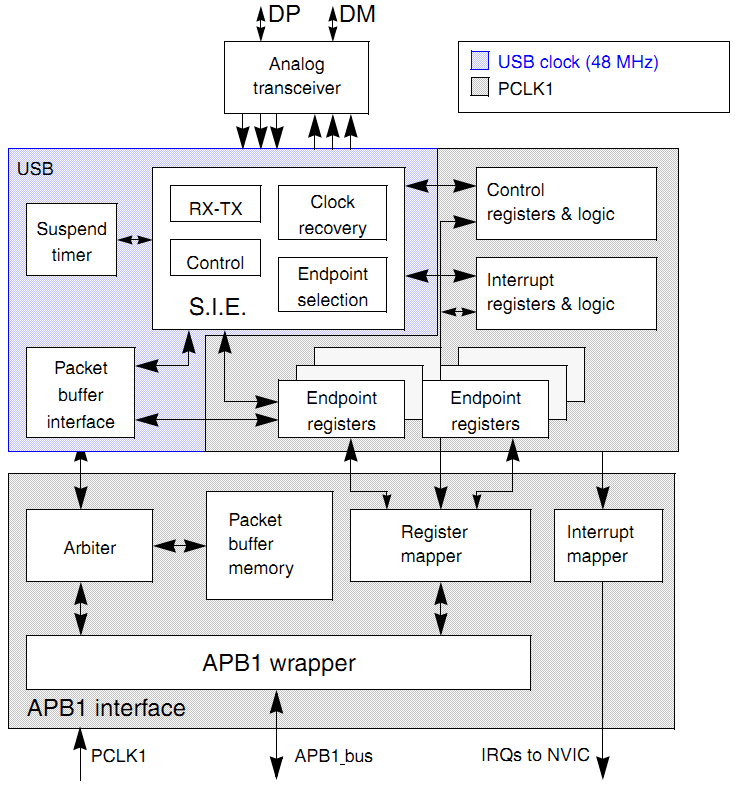

< 
:doc:`主页<index>` /
:doc:`目录<index_chs>` /
>

STM32F1的USB介绍
================

就目前接触到的Jlink、ST-Link都是用STM32F103C8来做USB适配器的，
所以gpJtag也打算用这个芯片。由于windows的驱动需要签名，
而自己开发的开源东西申请签名太麻烦了，所以就直接用libusb来做驱动层。

STM32F103C8包含一个USB2.0全速的PHY（12Mhz），
使用内部PLL从主时钟生成48Mhz的设备时钟，所以也不需要额外的晶振。

这个是USB的框图 [#f1]_ :

USB的寄存器地址从 0x4000 5C00 开始，USB的专属SRAM从 0x4000 6000 开始，
512字节，可以配置成16个单向的端点或者8个双向的端点。

简单介绍一下主要的部分：

* SIE (Serial Interface Engine) 基本上可以算是USB的PHY，
  包含信号的生成、编解码，
* Packet buffer Interface 用于共享缓冲区的控制。
  顺便说一下USB的SRAM是双口RAM。

STM32的USB可以配置成双缓冲模式，这样可以提高传输速率。

.. rubric:: Footnotes

.. [#f1] RM0008 - STM32F10xxx Reference Manual, page 598

